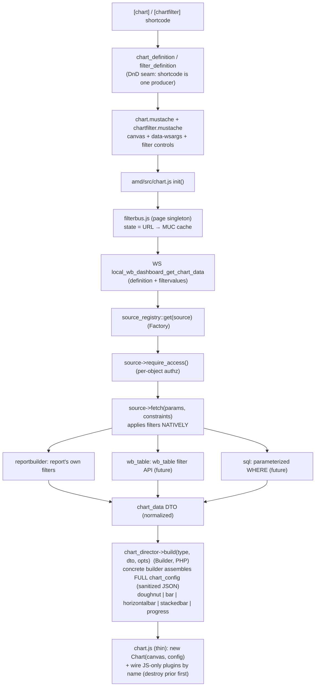
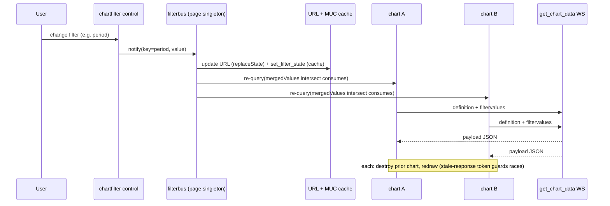

# local_wb_dashboard — architecture

Generic, shortcode-driven chart engine. One shortcode renders any supported chart
type from any registered data source; a second shortcode renders page-level filters
that every chart on the page reacts to.

## Patterns

- **Builder** — `chart_director` selects a concrete `chart_builder`
  (`doughnut_chart_builder`, `bar_chart_builder`) that assembles the **complete**,
  Chart.js-ready `chart_config` in PHP. The JS is a thin runtime: it instantiates
  the config and wires JS-only plugins (center-text) by name — it builds no config.
- **Factory** — `filter_factory` creates filter controls; `source_registry` is the
  internal source factory/allowlist.
- **DTO** — `chart_data` (+ `chart_series`) is the normalized shape every source
  produces and the builder consumes. `filter_constraint` is the neutral, source-
  agnostic expression of a filter value.
- **Definitions (drag-and-drop seam)** — `chart_definition` / `filter_definition`
  fully describe a chart/filter. The shortcode is one producer today; a future
  DB-backed drag-and-drop builder is another, feeding the same pipeline.

## Filters

Filters are page-scoped and **source-native**: a filter emits a neutral
`filter_constraint`; each source applies the ones it recognises in its own way
(the Report Builder source maps the key to the report's own filter). Shared state
lives in the URL (canonical) with a per-user MUC cache (`page_filter_state`) as the
persistence fallback; the `filterbus` JS singleton owns it and fans changes out to
every subscribed chart.

## Component / data flow — first render

## Page-level filter change (fan-out to all charts)

## Supported chart types (v1)

| Semantic type   | Concrete builder + configuration                                      |
|-----------------|-----------------------------------------------------------------------|
| `doughnut`      | `doughnut_chart_builder` — cutout + center-text plugin                |
| `bar`           | `bar_chart_builder` (vertical)                                        |
| `horizontalbar` | `bar_chart_builder` + indexAxis 'y'                                   |
| `stackedbar`    | `bar_chart_builder` + stacked scales, per-dataset stack groups        |
| `progress`      | `bar_chart_builder` horizontal + stacked + fixed axis max             |
