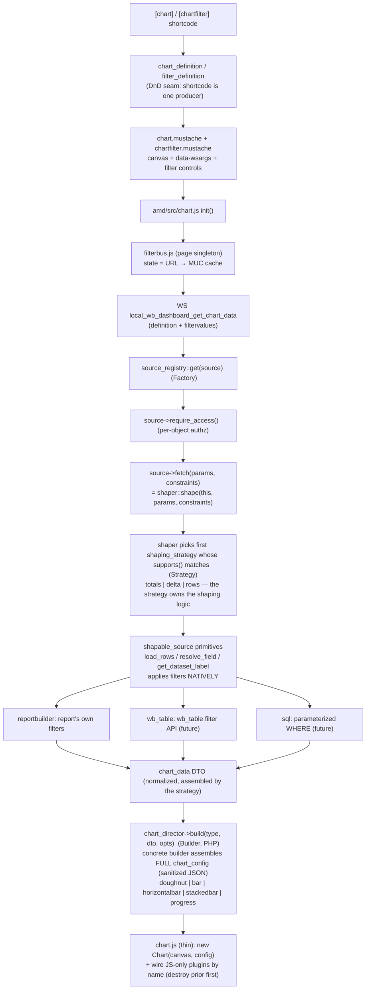
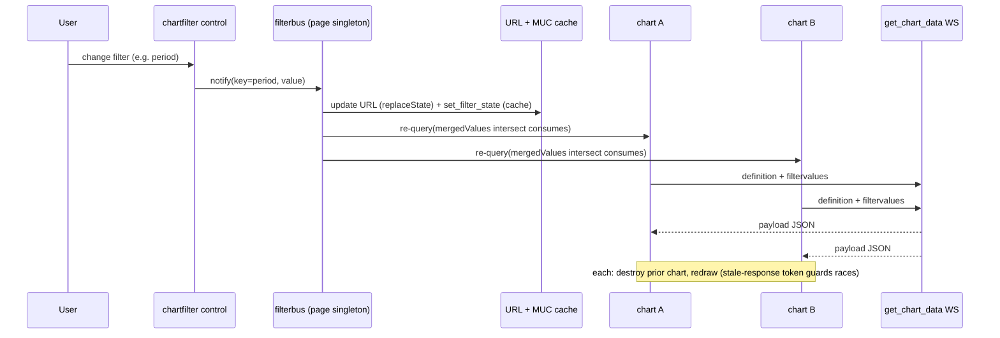
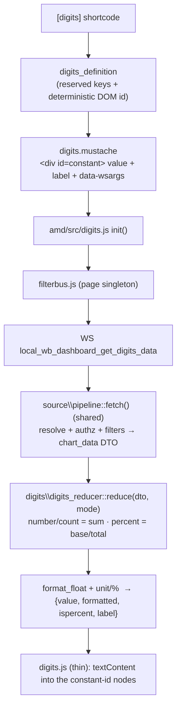

# local_wb_dashboard — architecture

Generic, shortcode-driven dashboard engine. One shortcode renders any supported
chart type from any registered data source; a second renders a single value
(number/count/percentage) from the same sources; a third renders page-level filters
that every chart and value on the page reacts to.

## Patterns

- **Builder** — `chart_director` selects a concrete `chart_builder`
  (`doughnut_chart_builder`, `bar_chart_builder`) that assembles the **complete**,
  Chart.js-ready `chart_config` in PHP. The JS is a thin runtime: it instantiates
  the config and wires JS-only plugins (center-text) by name — it builds no config.
- **Shared data pipeline** — `local\source\pipeline::fetch()` is the single
  server-side path from a definition to data: resolve the source, allowlist its
  params, enforce object-level access, translate page filters into neutral
  constraints and return the `chart_data` DTO. Every display web service
  (`get_chart_data`, `get_digits_data`) runs this identical pipeline; only what it
  does with the DTO differs.
- **Strategy (shaping)** — the shaping modes (rows, multi-dataset totals,
  two-dataset delta) are **source-agnostic** `shaping_strategy` classes in
  `local\source\shaping`; each owns its shaping logic and declares from the params
  alone whether it applies. `shaper::shape()` walks them in priority order, so a
  source's `fetch()` is one line. Strategies reach back into the source only
  through the `shapable_source` data primitives (`load_rows` / `resolve_field` /
  `get_dataset_label`) — a new source implements those three and every shaping
  mode (and thus every chart type) works immediately, no shaping code of its own.
- **Reducer** — for single-value fields, `local\digits\digits_reducer` collapses the
  same `chart_data` DTO to one `digits_result` (a number = sum of the series, or a
  percentage = base ÷ total from the two-report delta's `axismax`). The digits JS is
  a thin runtime like the chart one, but writes DOM text (via `textContent`) instead
  of drawing a canvas.
- **Factory** — `filter_factory` creates filter controls; `source_registry` is the
  internal source factory/allowlist.
- **DTO** — `chart_data` (+ `chart_series`) is the normalized shape every source
  produces; the chart builder and the digits reducer both consume it.
  `filter_constraint` is the neutral, source-agnostic expression of a filter value.
- **Definitions (drag-and-drop seam)** — `chart_definition` / `digits_definition` /
  `filter_definition` fully describe a chart/value/filter. The shortcode is one
  producer today; a future DB-backed drag-and-drop builder is another, feeding the
  same pipeline. `digits_definition` also derives a **deterministic, constant DOM id**
  from its configuration so the rendered value can be targeted from CSS.

## Filters

Filters are page-scoped and **source-native**: a filter emits a neutral
`filter_constraint`; each source applies the ones it recognises in its own way
(the Report Builder source maps the key to the report's own filter). Shared state
lives in the URL (canonical) with a per-user MUC cache (`page_filter_state`) as the
persistence fallback; the `filterbus` JS singleton owns it and fans changes out to
every subscribed chart.

Constraint contract for sources: `OP_BETWEEN` always carries a two-element
`[min, max]` value where `0` means "unbounded on that side" (the `daterange`
control emits `[fromtimestamp, totimestamp]` this way). A source must apply
open-ended ranges accordingly and silently ignore any constraint whose operator
it cannot map — never error on an unknown one.

## Component / data flow — first render

## Page-level filter change (fan-out to all charts)

## Supported chart types (v1)

| Semantic type   | Concrete builder + configuration                                      |
|-----------------|-----------------------------------------------------------------------|
| `doughnut`      | `doughnut_chart_builder` — cutout + center-text plugin                |
| `bar`           | `bar_chart_builder` (vertical)                                        |
| `horizontalbar` | `bar_chart_builder` + indexAxis 'y'                                   |
| `stackedbar`    | `bar_chart_builder` + stacked scales, per-dataset stack groups        |
| `progress`      | `bar_chart_builder` horizontal + stacked + fixed axis max             |

## Single-value fields (digits)

The `[digits]` shortcode is the non-canvas display component. It shares the source
layer and filter behaviour with charts but renders one value as DOM text.

| `display` mode | Reduction of the DTO |
|----------------|----------------------|
| `number` / `count` | Sum of the first series' data points (parts of one whole). |
| `percent` | `base ÷ total × 100`. base = first data point; total = `axismax` meta (delta), else the second data point (two-report part/whole ratio), else base. Divide-by-zero &rarr; 0. |
